# CoreFiscal

Sistema fiscal e de gestão empresarial desenvolvido em **Delphi 10.4** com **uniGUI**. A aplicação possui interface híbrida e pode ser utilizada pelo navegador ou por dispositivos móveis.

## Principais recursos

- Ambiente multiempresa
- Emissão e gerenciamento de NF-e, NFC-e e MDF-e
- Integração TEF com Pay&Go e SiTef
- Escrituração SPED Fiscal
- Área dedicada ao contador
- Envio de notas para a contabilidade
- Envio de DANFE pelo WhatsApp
- Cadastro de clientes, produtos e transportadoras
- Controle de veículos e condutores
- Configuração de tributações
- Lançamento de notas de compra
- Gerenciamento de documentos fiscais emitidos
- Ordens de serviço
- Contas a pagar e a receber
- Relatórios gerenciais
- Controle de empresas e usuários

## Tecnologias

- Delphi 10.4
- uniGUI
- Firebird
- ACBr
- Aplicação web responsiva para desktop e celular

## Código-fonte

O projeto Delphi está disponível no diretório [`Fontes`](Fontes). Para compilar, instale as dependências utilizadas pelo projeto e revise as configurações de conexão com o banco de dados, certificados, serviços fiscais e integrações externas.

> O banco de dados operacional, credenciais, certificados e binários compilados não fazem parte deste repositório.

## Imagens

<table>
  <tr>
    <td>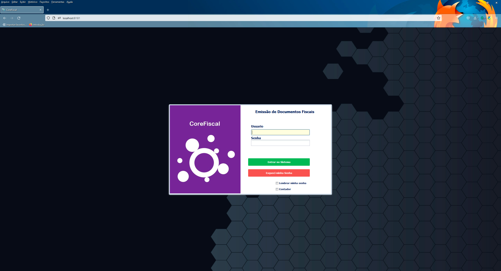</td>
    <td>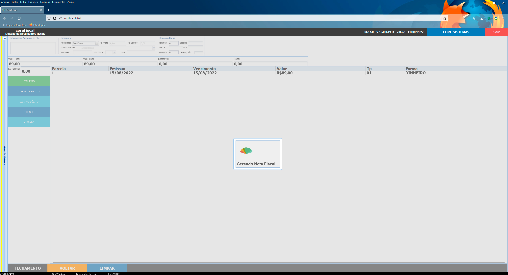</td>
  </tr>
  <tr>
    <td>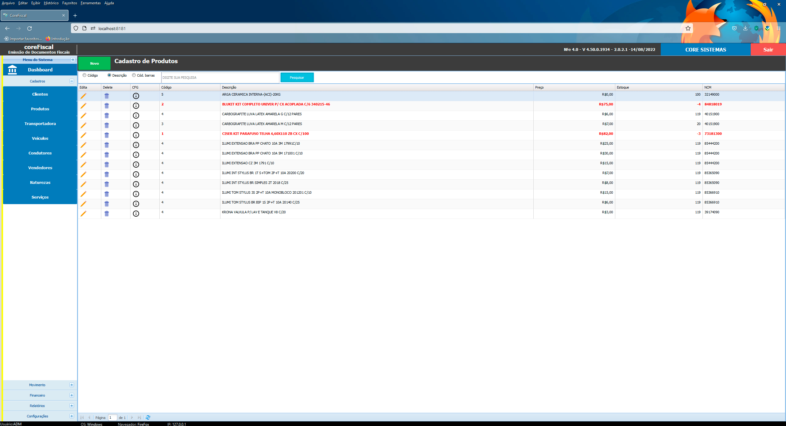</td>
    <td>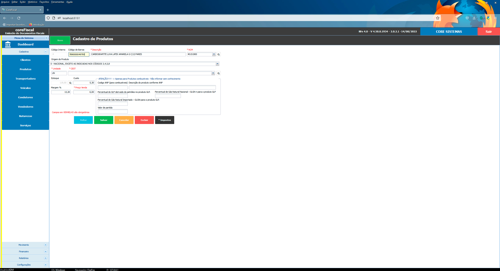</td>
  </tr>
  <tr>
    <td>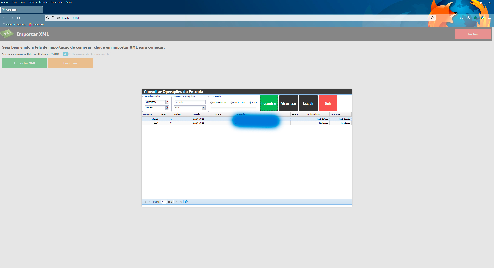</td>
    <td>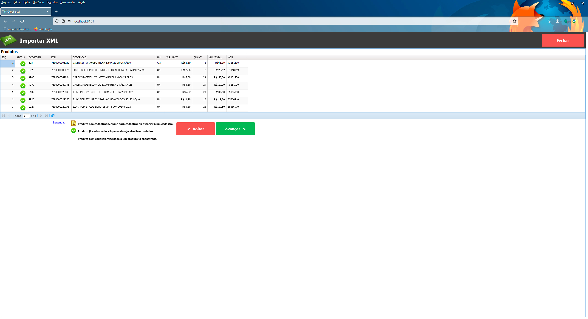</td>
  </tr>
  <tr>
    <td>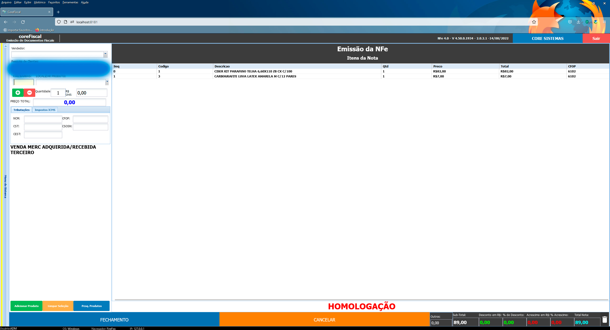</td>
    <td>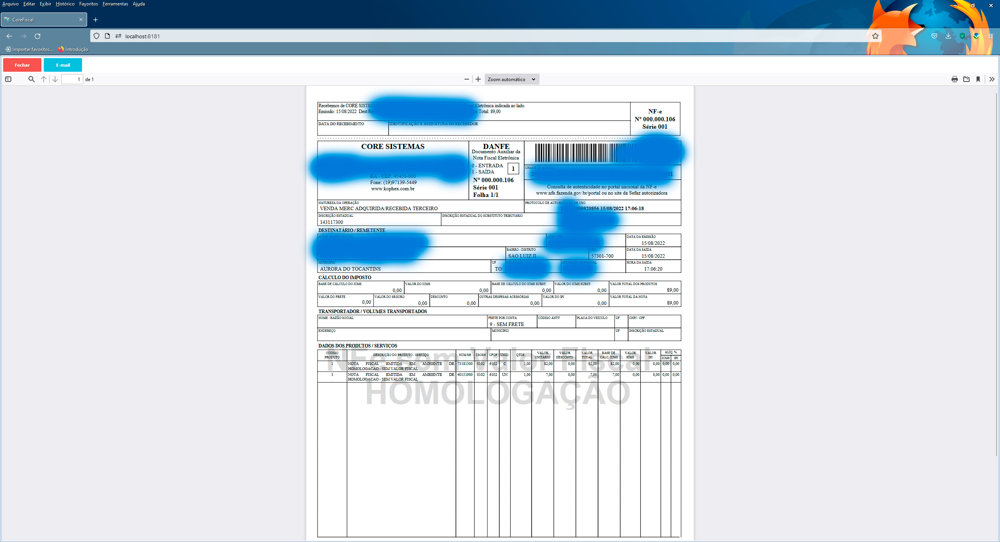</td>
  </tr>
  <tr>
    <td>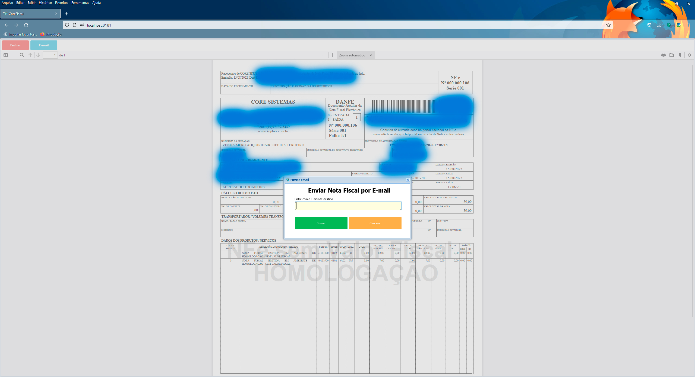</td>
    <td>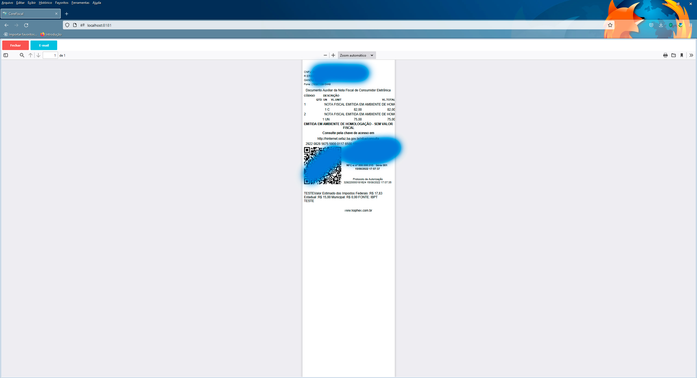</td>
  </tr>
  <tr>
    <td>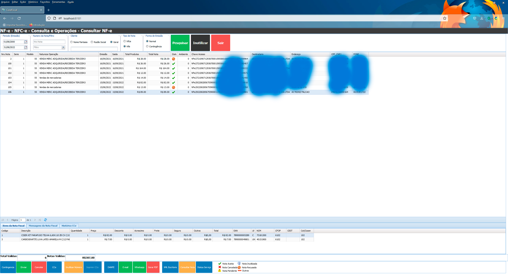</td>
    <td>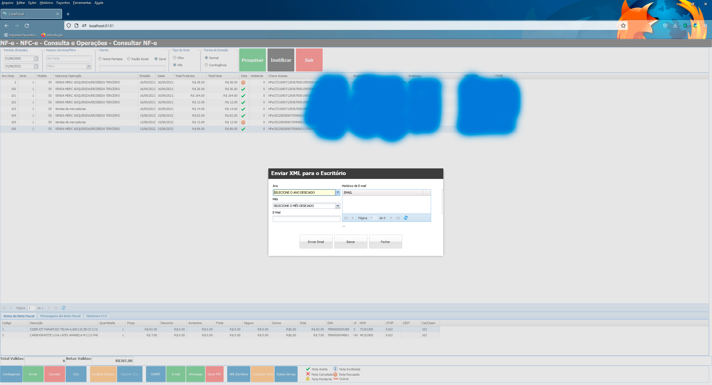</td>
  </tr>
  <tr>
    <td>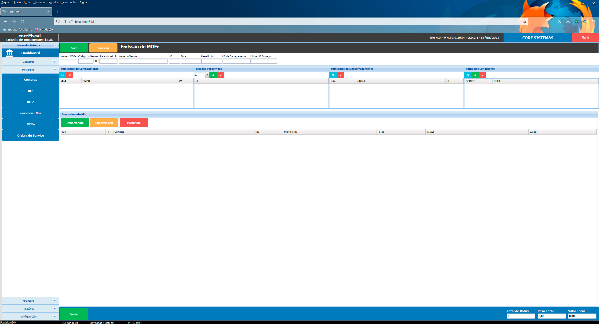</td>
    <td>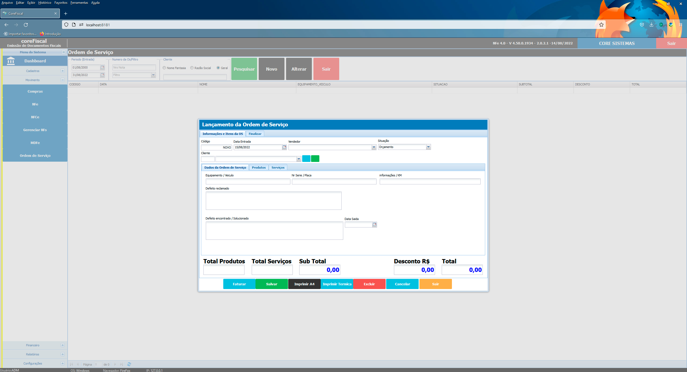</td>
  </tr>
  <tr>
    <td>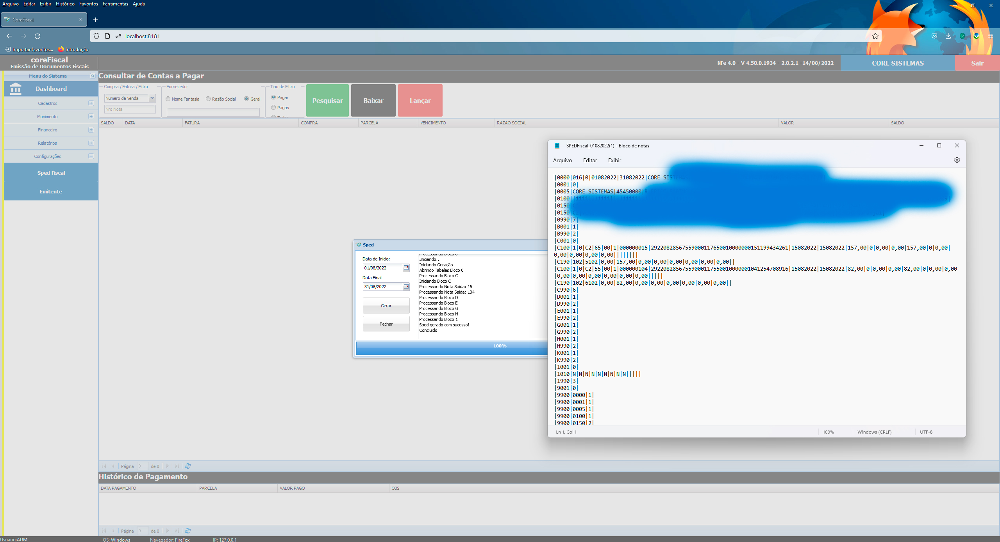</td>
    <td>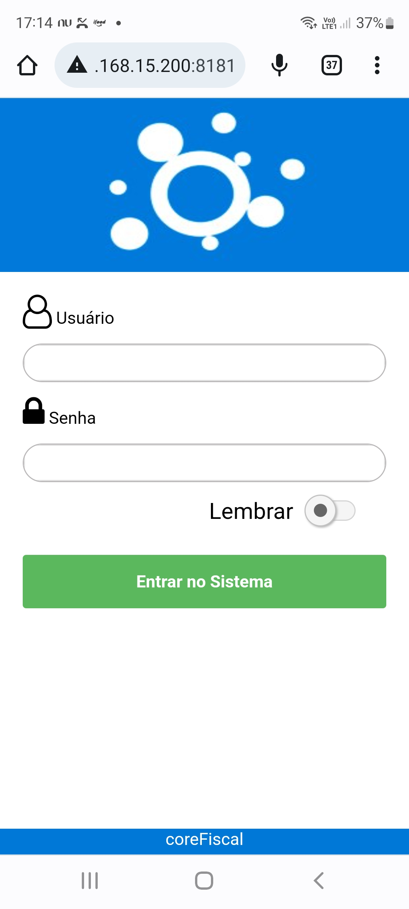</td>
  </tr>
  <tr>
    <td>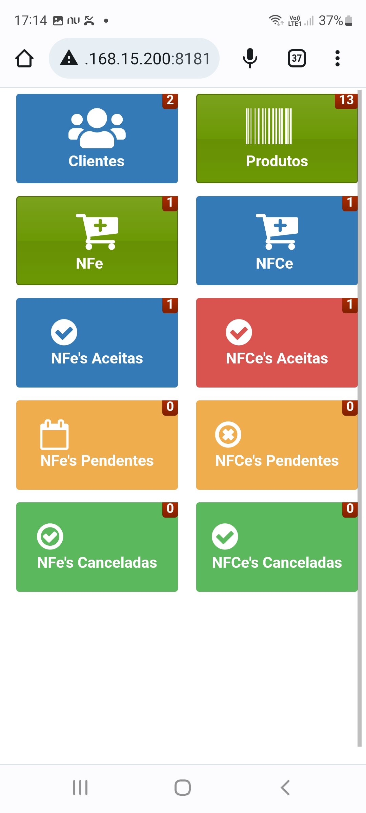</td>
    <td>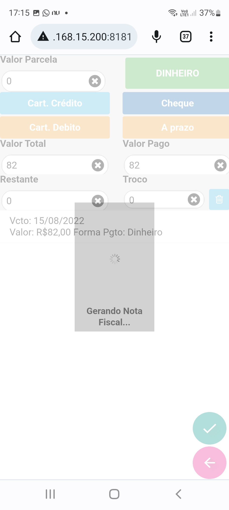</td>
  </tr>
  <tr>
    <td>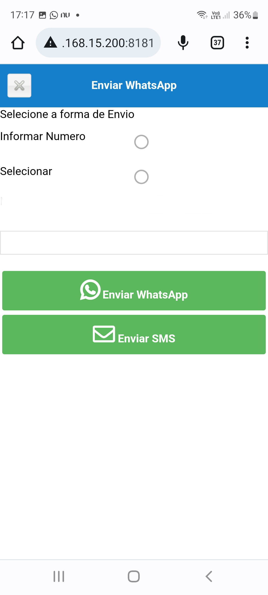</td>
    <td></td>
  </tr>
</table>

## Observação

Antes de utilizar em produção, configure seu próprio banco de dados e valide as regras fiscais conforme o regime tributário, o estado e a legislação aplicável à empresa.
